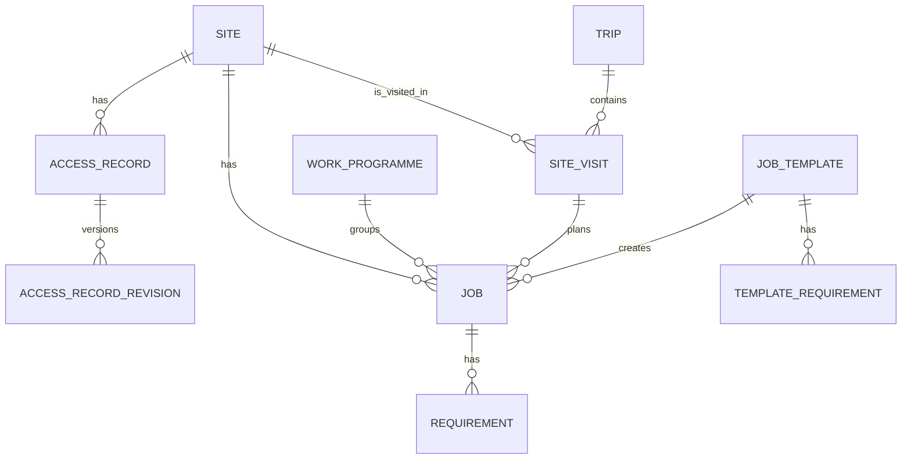

# Access Atlas

## What It Is

Access Atlas is a field work planning application for teams that organise trips, site visits, jobs, and site access information against sites managed in an external source of truth.

The application owns planning data such as trips, site visits, jobs, work programmes, job templates, requirements, access records, notes, and history. Site identity, descriptions, and coordinates stay read-only and are synced from a configured external feed. Access Atlas extends that synced site data with site-specific access records and revisions stored locally.

## Domain Model

Core objects:

- `Site`: a synced reference to a real-world site from an external system
- `Access Record`: a named site-access route or method, such as general road access or emergency boat access
- `Access Record Revision`: a versioned GeoJSON record for an Access Record
- `Trip`: a planned field deployment
- `Site Visit`: a planned attendance at one site during a trip
- `Job`: a unit of work for a site, either unassigned or assigned to a site visit
- `Work Programme`: a dated batch of jobs with a shared due date
- `Job Template`: a reusable starting point for common jobs
- `Requirement`: something needed to complete a job



## Site Sync

Access Atlas does not own canonical site identity, descriptions, coordinates, or addresses.

It consumes one configured HTTP JSON feed and upserts local site references from that feed. Synced site fields stay read-only in Access Atlas. Access-start coordinates are owned per Access Record revision (GeoJSON), not by the site sync feed. If no external feed is configured, the app can use its own dummy feed for local development and evaluation.

Sites present in the latest feed are marked `active`. Previously synced sites
missing from the latest feed are marked `stale` and remain visible for history
and planning context.

The feed contract is intentionally narrow:

- one HTTP endpoint
- bearer-token authentication
- required identity and site coordinate fields
- optional site description
- local upsert of site references

Example feed:

```json
{
  "schema_version": "1.0",
  "source_name": "example-source",
  "generated_at": "2026-04-20T10:30:00Z",
  "sites": [
    {
      "external_id": "12345",
      "code": "SITE-A",
      "name": "Site A",
      "description": "Primary ridge station with exposed weather conditions.",
      "latitude": -41.12345,
      "longitude": 174.12345
    },
    {
      "external_id": "67890",
      "code": "SITE-B",
      "name": "Site B",
      "description": "Valley repeater near the main service road.",
      "latitude": -44.1254,
      "longitude": 169.3521
    }
  ]
}
```

Configure site sync through `.env`:

```env
SITE_FEED_URL=http://127.0.0.1:8000/dummy/site-feed.json
SITE_FEED_TOKEN=dev-token
```

## Development

Access Atlas is a Django application with PostgreSQL. Local development normally runs Django directly and PostgreSQL through Docker Compose.

Prerequisites:

- Python 3.14
- `uv`
- `pnpm`
- Docker with Docker Compose

Typical setup:

```bash
cp .env.example .env
docker compose up -d db
uv sync --dev
pnpm install
pnpm build:frontend
uv run python manage.py migrate
uv run python manage.py runserver
```

The app will be available at `http://127.0.0.1:8000/`.

Use `.env.example` as the starting point for configuration. Authentication, database, site feed, and deployment settings all live there.

Leaflet runtime assets are generated into `static/vendor/` by `pnpm build:vendor`
or `pnpm build:frontend`. Those files are not tracked in git; the container
build generates them as part of the frontend stage.

The compiled stylesheet `static/css/app.css` is also generated and not tracked
in git. During normal frontend work, run `pnpm watch:css` in a second terminal
so changes under `static/css/src/` rebuild automatically while Django runs.

Useful commands:

```bash
uv run python manage.py sync_sites
uv run python manage.py check
uv run pytest
uv run ruff check .
uv run ruff format --check .
pnpm install
pnpm build:frontend
pnpm watch:css
pnpm lint:frontend
```

## Deployment

Access Atlas is packaged as a containerised Django application backed by PostgreSQL.

At a high level:

1. configure environment variables
2. point the app at PostgreSQL
3. run migrations
4. start the web container

The intended deployment shape is a web service or container platform talking to an external PostgreSQL instance.

Set `CSRF_TRUSTED_ORIGINS` to the public HTTPS origin when deploying behind a reverse proxy or container platform, for example `CSRF_TRUSTED_ORIGINS=https://access-atlas.example.com`.
