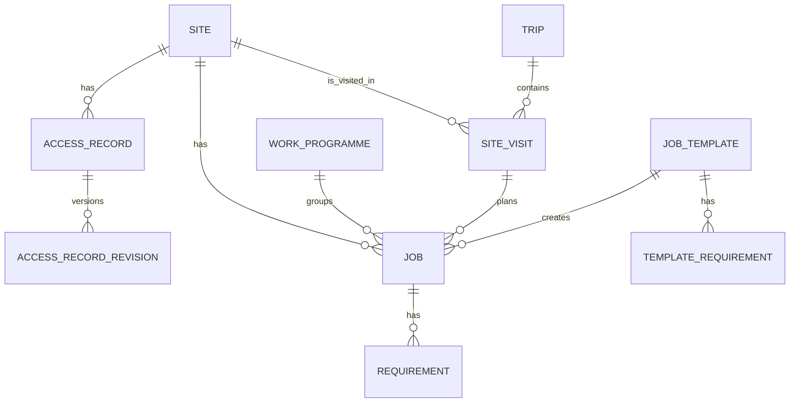
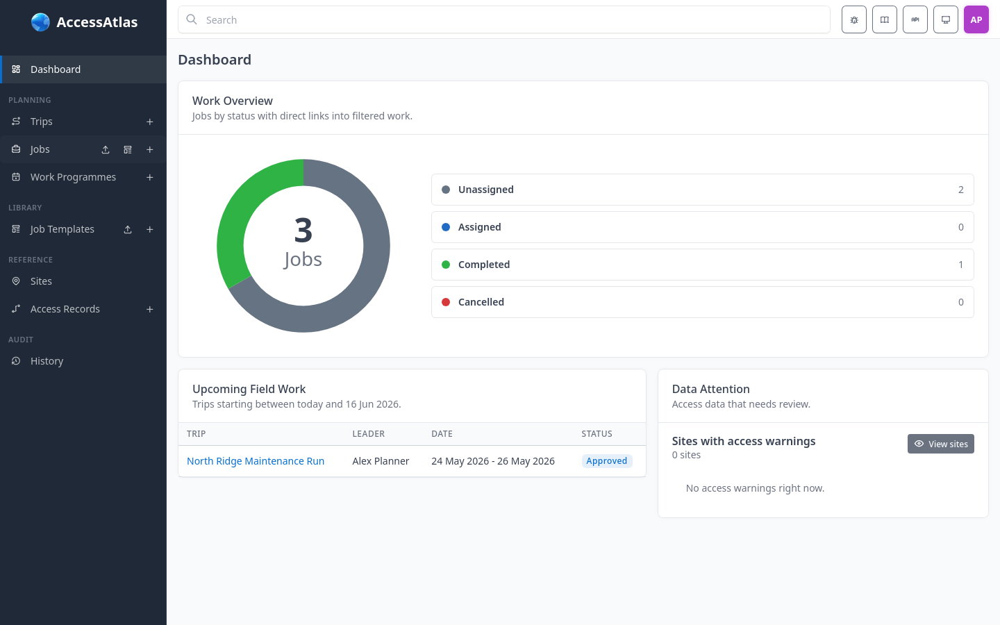
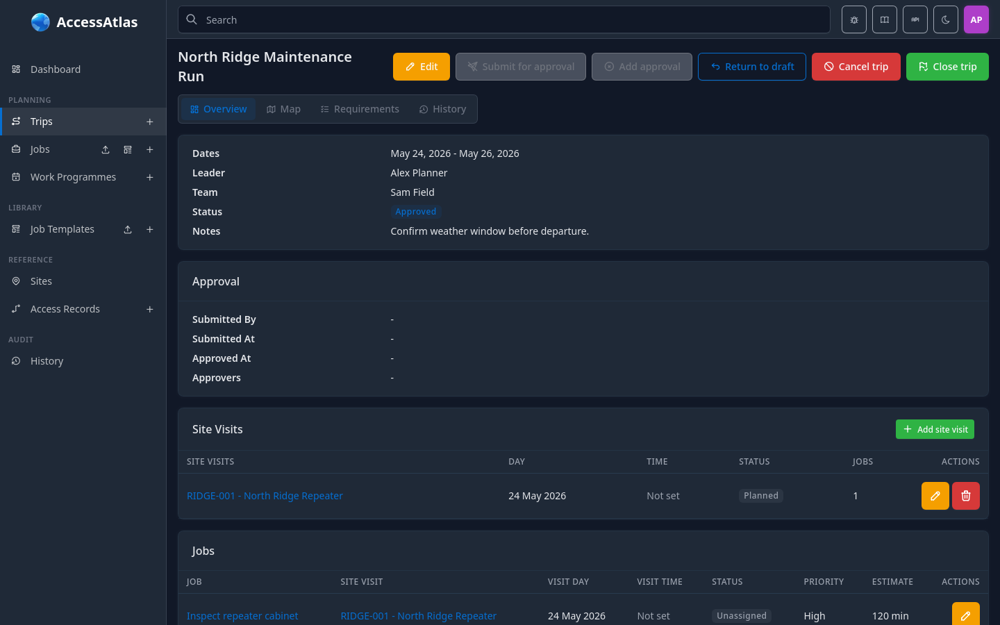

# Access Atlas Documentation

Access Atlas is a field work planning application for teams that organise
Trips, Site Visits, Jobs, Work Programmes, Requirements, and site access
information around externally managed sites.

The application owns planning data. Canonical site identity, site codes, site
names, coordinates, addresses, and source location details remain owned by the
configured external site feed.

> [!NOTE]
> Access Atlas is not a generic task manager. Use the product terms in these
> docs when describing planning workflows.

## Documentation Map

- [Getting started](getting-started/overview.md)
- [Planning workflow](user-guide/planning-workflow.md)
- [Object reference](reference/sites.md)
- [Administration](administration/configuration.md)
- [Integrations](integrations/site-feed.md)
- [REST API](integrations/rest-api.md)

## Core Relationships

## Where To Start

Administrators should start with [configuration](administration/configuration.md)
and [site feed setup](integrations/site-feed.md).

Field planners should start with the
[planning workflow](user-guide/planning-workflow.md), then read the reference
pages for [Trips](reference/trips.md), [Site Visits](reference/site-visits.md),
and [Jobs](reference/jobs.md).

## Screenshots

