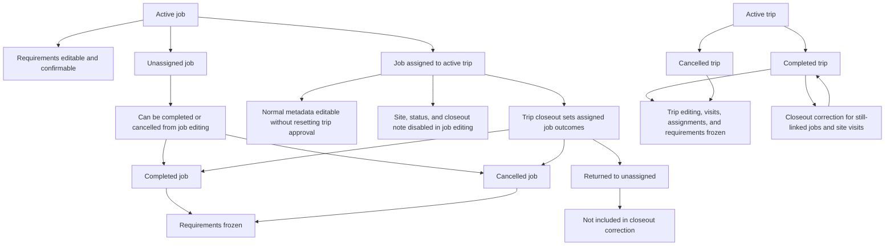

# Workflow Policy

## Workflow Overview

## Jobs

Jobs can be planned and edited while active. A job assigned to an active trip can
still have normal metadata updated without resetting trip approval, but its site
assignment and outcome fields are owned by the trip workflow:

- `site`, `status`, and `closeout_note` are visible but disabled in normal job
  editing while the job is assigned to a trip.
- unassigned jobs can be completed or cancelled directly from normal job editing.
- completed jobs may have a closeout note, but do not require one.
- cancelled jobs require a closeout note.
- jobs assigned to completed or cancelled trips cannot be edited through normal
  job editing.

## Requirements

Requirements describe what is needed to complete a job.

- active jobs can have requirements added, edited, deleted, and confirmed.
- completed and cancelled jobs freeze requirement structure and confirmation.

## Trips

Trips are planning containers for site visits and assigned jobs.

- active trips can be edited according to the normal approval reset rules.
- completed and cancelled trips freeze normal trip editing, site visit editing,
  job assignment changes, and requirement changes.
- trip cancellation returns active assigned jobs to unassigned and marks planned
  site visits as skipped.
- trip closeout resolves site visits and sets assigned job outcomes to completed,
  cancelled, or returned to unassigned.

## Closeout Correction

Completed trips can use closeout correction to amend closeout outcomes with an
explicit correction reason. The correction workflow reuses the closeout form for
still-linked site visits and jobs, then writes clear history entries.

Known limitation: jobs that were returned to unassigned during closeout are no
longer linked to the trip, so they do not appear in closeout correction. Restoring
or correcting returned jobs is not currently a supported feature.

Cancelled-trip correction is also not currently supported because cancellation returns
active assigned jobs and removes their trip assignment.
